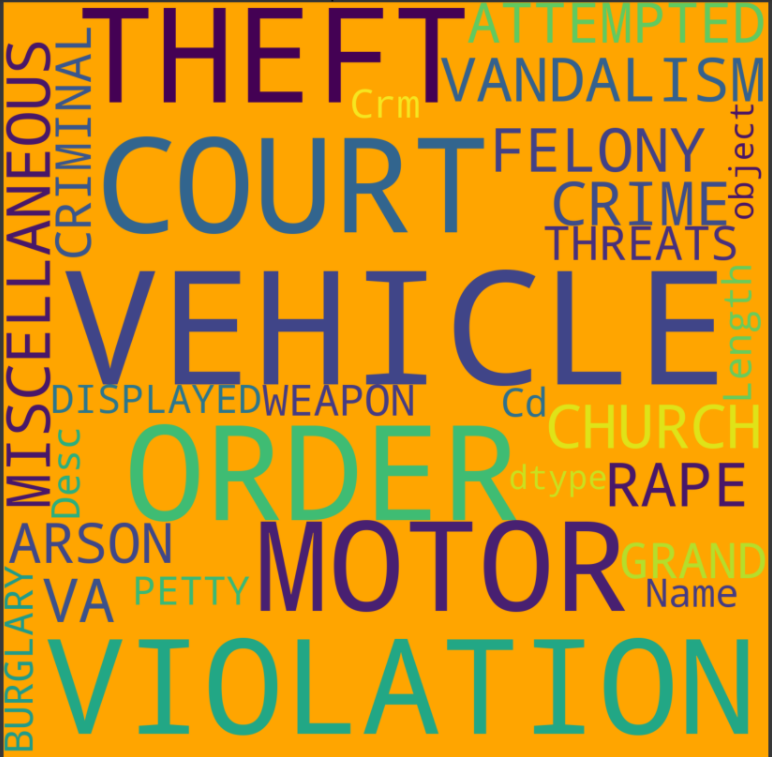
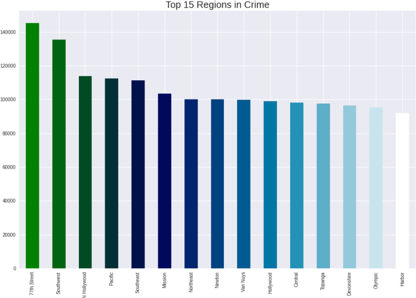
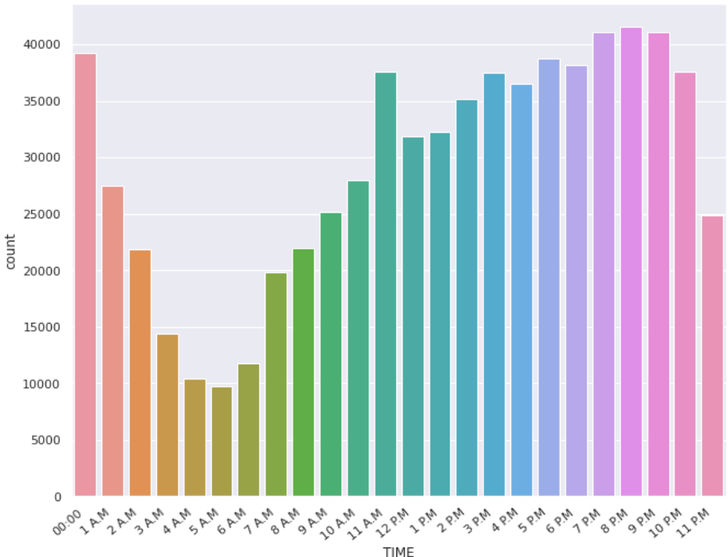
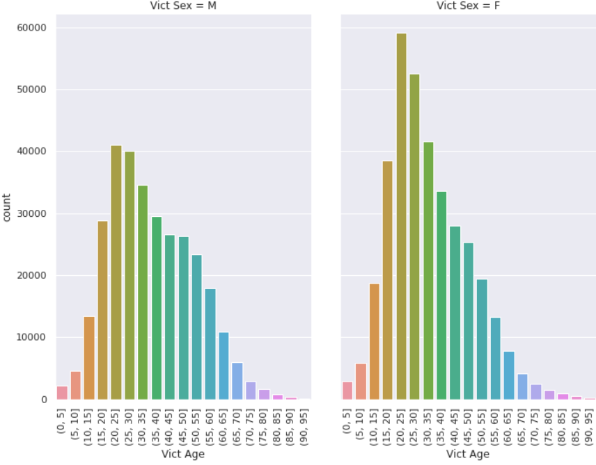

# CRIME ANALYSIS - LOS ANGELES

## INTRODUCTION
Crime  as  the  word  suggests  it  is  the  infringement  thatpeople  do  and  it  is  generally  committed  against  the  rulesand  it  is  punishable.  Crime  Analysis  is  part  of  research  incriminology  where  various  patterns  are  used  to  understandthe  actual  crime.  Criminal  activities  are  a  regular  occurrenceall  over  the  world.  Researchers  also  haven  been  studyingthe   relationship   between   crime   rates   and   socio-economicactivities like unemployment,earnings level etc. Governmentsare investing a large amount on time to combat illegal crimesusing  technology. This dataset reflects incidents of crime in the City of Los Angeles from 2010 - 2019. This data is transcribed from original crime reports that are typed on paper and therefore there may be some inaccuracies within the data. Address fields are only provided to the nearest hundred block in order to maintain privacy. This data is as accurate as the data in the database.

## PROBLEM STATEMENT
In  this  paper  we  try  to  understand  the  crime  dynamics  ina  large  city  such  as  Los  Angeles  by  visualizing  the  crimeswith respect to the location and the area they were committedin.  We  try  to  identify  the  patterns  in  the  crimes  with  respectto  location,  area,  dates/months.  and  analyze  the  dataset  forpatterns  related  to  victim  data  (age,  gender  and  race)  andtime.  For  a  given  time/weekday/location,  predict  the  areaswhere  a  crime  is  most  likely  to  happen,  and  cluster  thelocations depending on the number of crimes.

## EXPLORATORY DATA ANALYSIS

## MACHINE LEARNING

### CLASSIFICATION
We applied Random Forest Classification  and  XGBOOST  to  predict  the  possible  crime category  based  on  several  features  like  Victim  Age,  Weapon Used, Area Name etc. Next we applied hyperparameter tuningusing  RandomizedSearchCV  to  our  XGBOOST  model  with3 fold cross validation to find out the average accuracy.
<ul>
  <li>KNN: 41% </li>
  <li>Random Forest: 44.2% </li>
  <li>Xgboost: 48.7% </li>
</ul>

### CLUSTERING
So initially we plot the locations of Los Angeles using the latitude and longitudes. Next we segregate the  most  probable  locations  into  5  clusters  depending  on  the total number of crimes committed in that particular location using the Kmeans Clustering technique. So the 5 colours represent the 5 different clusters along with their labels on the map.

