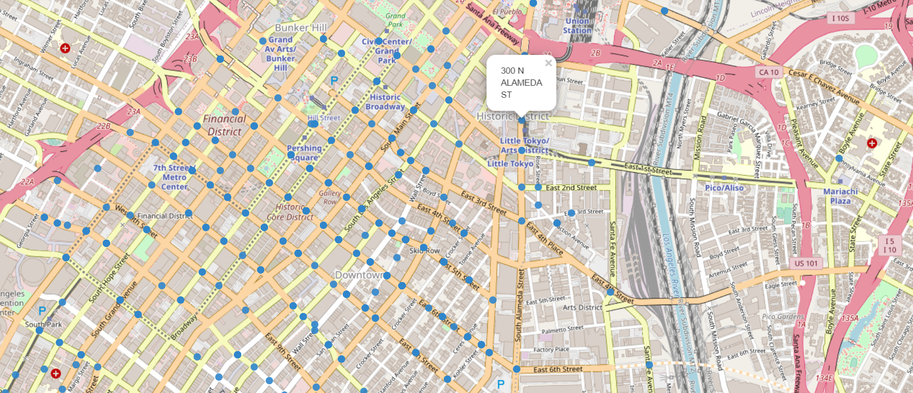
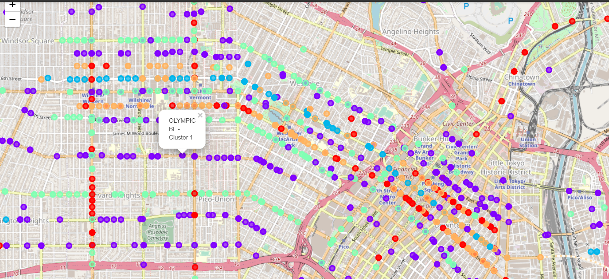

# CRIME ANALYSIS - LOS ANGELES

## INTRODUCTION
Crime  as  the  word  suggests  it  is  the  infringement  that people  do  and  it  is  generally  committed  against  the  rule sand  it  is  punishable. Crime Analysis  is  part of research incriminology where various patterns are used to understand the actual crime. Criminal activities are a regular occurrence all over the world. Researchers also  have been studying the relationship between crime rates and socio-economic activities like unemployment,earnings level etc. Governments are investing a large amount on time to combat illegal crimesusing technology.This dataset reflects incidents of crime in the City of Los Angeles from 2010 - 2019. This data is transcribed from original crime reports that are typed on paper and therefore there may be some inaccuracies within the data. Address fields are only provided to the nearest hundred block in order to maintain privacy. This data is as accurate as the data in the database.

## PROBLEM STATEMENT
In this paper we try to understand the crime dynamics in a large city such as Los  Angeles by visualizing the crimes with respect to the location and the area they were committed in. We try to identify the patterns in the crimes with respect to location, area, dates/months and  analyze the dataset for patterns related to victim data (age,  gender and race) and time. For a given  time/weekday/location, predict the areas where a crime is most likely to happen, and cluster the locations depending on the number of crimes.

## EXPLORATORY DATA ANALYSIS

## MACHINE LEARNING

### CLASSIFICATION
We applied Random Forest Classification  and  XGBOOST  to  predict  the  possible  crime category  based  on  several  features  like  Victim  Age,  Weapon Used, Area Name etc. Next we applied hyperparameter tuningusing  RandomizedSearchCV  to  our  XGBOOST  model  with3 fold cross validation to find out the average accuracy.
<ul>
  <li>KNN: 41% </li>
  <li>Random Forest: 44.2% </li>
  <li>Xgboost: 48.7% </li>
</ul>

### CLUSTERING
So initially we plot the locations of Los Angeles using the latitude and longitudes. Next we segregate the  most  probable  locations  into  5  clusters  depending  on  the total number of crimes committed in that particular location using the Kmeans Clustering technique. So the 5 colours represent the 5 different clusters along with their labels on the map.

# BIG PICTURE - A SAFE CITY
<ul>
  <li>Team Members:</li>
  <ul style="list-style-type:circle">
         <li>Adithya Bhat PR, PES1201800304</li>
         <li>Rohit Kumar AS, PES1201801890</li>
         <li>Mathang Peddi, PES1201800247</li>
  </ul>
  <li>Instructions to run the code:</li>
  <ul style="list-style-type:circle">
         <li>Dataset Link: <a href="https://drive.google.com/file/d/1w60FKrOy3NDHqnyx9ZiiFASfSDZzbUoF/view?usp=sharing">https://drive.google.com/file/d/1w60FKrOy3NDHqnyx9ZiiFASfSDZzbUoF/view?usp=sharing</a>
         <li>Download 'Crime_Data_from_2010_to_2019.csv' and '012_LOS_ANGELES_CRIMES.ipynb'</li>
         <li>Run '012_LOS_ANGELES_CRIMES.ipynb' colab file</li>
  </ul>
</ul>
